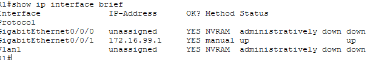
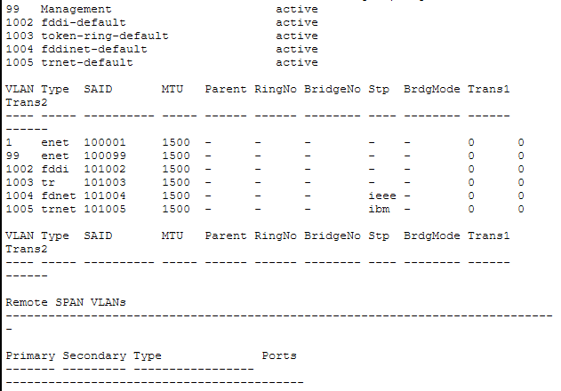
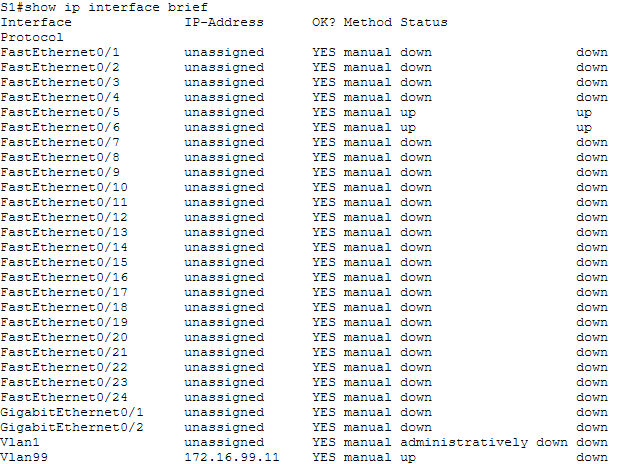
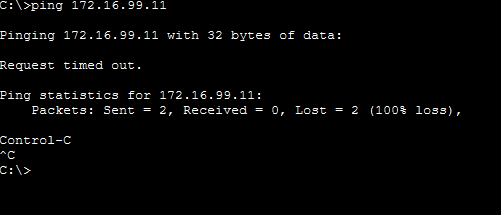
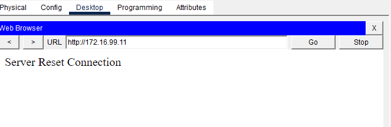
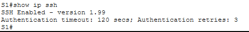

# Cisco — Sécurisation de base des périphériques

*Théorie : Cédric Surquin — Scalar | TD : Sécurisation de base d'un switch Cisco, 17/03/25*

## Objectifs
- Restreindre l'accès via une politique de mots de passe
- Mettre en place une bannière d'avertissement légal
- Sécuriser l'accès distant et chaque niveau de privilège Cisco IOS
- Chiffrer les mots de passe dans le fichier de configuration

## Principes de base
- Fermer physiquement l'accès au local technique
- Journaliser les accès au local technique
- Sécuriser a minima avec un mot de passe
- Mettre en place une politique de mots de passe robustes
- Éteindre les ports/interfaces/services inutilisés
- Chiffrer les mots de passe
- Utiliser une clé SSH pour la gestion à distance

## Sécuriser un appareil Cisco — checklist
- Mot de passe sur le port console
- Mot de passe sur le mode privilégié
- Interfaces dans un VLAN autre que le VLAN par défaut (VLAN 1)
- VLAN 1 désactivé (`shutdown`)
- SSH activé pour la gestion distante — **jamais Telnet**
- Déconnexion après délai d'inactivité
- Protection des ports (port security)

---

## 1. Authentification sur l'appareil

**Mode USER (port console) :**
```
enable
conf terminal
line console 0
password VOTRE_MOT_DE_PASSE
login
```

**Mode EXEC privilégié :**
```
enable
conf terminal
enable secret MOT_DE_PASSE_MODE_PRIVILEGIE
exit
```

## 2. Chiffrer les mots de passe en clair

Sans cette commande, les mots de passe (sauf `enable secret`, déjà haché) restent lisibles en clair dans le fichier de configuration.
```
service password-encryption
```

## 3. VLAN 1 — sortir les interfaces et l'éteindre

Le VLAN 1 existe par défaut sur tout appareil Cisco et est **non-supprimable** : il faut le désactiver pour compliquer la tâche à un attaquant, après avoir déplacé les interfaces actives vers un autre VLAN.

```
enable
configure terminal
vlan 45
exit
interface range fa0/1-24
switchport mode access
switchport access vlan 45
```
> Ne pas oublier d'activer le nouveau VLAN (`interface vlan 45` puis `no shutdown`).

```
enable
configure terminal
interface vlan 1
shutdown
exit
```

## 4. Délai avant déconnexion par inactivité

```
enable
configure terminal
line console 0     ! ou : line vty 0-15
exec-timeout 10
exit
```

## 5. Protéger les ports (port security)

**Principe :** un port n'accepte de communiquer qu'avec une ou plusieurs adresses MAC précises, avec une politique en cas de violation (adresse MAC inattendue).

```
interface TYPE PORT
switchport mode access
switchport port-security maximum 1
switchport port-security mac-address sticky
switchport port-security violation shutdown
```

**Politiques de violation :**
| Politique | Comportement |
|---|---|
| `shutdown` (défaut) | Le port s'éteint et passe en `err-disabled` |
| `restrict` | Le port reste actif, rejette les trames interdites, incrémente un compteur, logue |
| `protect` | Le port reste actif, rejette les trames, mais sans compteur ni alerte SNMP |

## 6. Accès distant SSH

SSH (Secure Shell) chiffre l'intégralité des échanges entre client et équipement — c'est le standard de l'industrie pour l'administration distante en CLI. **Il est inactif par défaut.**

**Étapes théoriques :**
1. Changer le nom de l'appareil
2. Donner un nom de domaine à l'appareil
3. Créer un compte utilisateur et un mot de passe
4. Générer une clé SSH
5. L'appliquer aux lignes vty (ou une interface) + forcer la version 2

```
ip domain name cisco.com
username NOM_USER secret MDP
crypto key generate rsa
line vty 0-15
login local
transport input ssh
exit
ip ssh version 2
```

---

# Travail Dirigé — Sécurisation de base d'un switch Cisco

**Intervenant :** Cédric Surquin — 17/03/25 · **Réalisé sur :** Packet Tracer (routeur ISR, switch 2960)

## Points de vigilance (erreurs à ne pas refaire)
- ⚠️ **Toujours configurer l'IP du PC-A manuellement** (Desktop → IP Configuration) avant de tester la connectivité — sinon les pings échouent (100% loss) alors que la config réseau des autres appareils est correcte.
- ⚠️ **Nomenclature des interfaces variable selon le modèle de routeur** : sur un 1941/4221 → `g0/1` ; sur le modèle utilisé ici (ISR avec nommage à 3 niveaux) → `g0/0/1`. Toujours vérifier avec `show ip interface brief` avant de taper une commande `interface`.
- ⚠️ Les commandes `show ip http(s) server status` et l'accès HTTP/HTTPS au switch sont peu fiables voire non simulés dans Packet Trace — ne pas s'inquiéter en cas d'échec, c'est une limite du simulateur, pas une erreur de config.

## Topologie
```
R1 (G0/0/1) ---- Fa0/5 [ S1 ] Fa0/6 ---- PC-A
```

## Tableau d'adressage
| Appareil | Interface | Adresse IP | Passerelle |
|---|---|---|---|
| R1 | G0/0/1 | 172.16.99.1/24 | N/A |
| S1 | VLAN99 | 172.16.99.11/24 | 172.16.99.1 |
| PC-A | NIC | 172.16.99.3/24 | 172.16.99.1 |

---

## Partie 1 — Configuration de la topologie et initialisation des périphériques

**Étape 1.** Câblez le réseau conformément à la topologie.
**Étape 2.** Initialisez et redémarrez le routeur et le commutateur.

```
enable
erase startup-config
reload
```
(confirmer, répondre « no » si demande de sauvegarde ou de dialogue de config initiale)

- [x] Câblage conforme à la topologie (Copper Straight-Through R1↔S1 et S1↔PC-A)
- [x] Initialisation/redémarrage de R1 et S1

---

## Partie 2 — Configuration des paramètres de base et vérification de la connectivité

### Étape 1 — IP sur PC-A
IP `172.16.99.3` / masque `255.255.255.0` / passerelle `172.16.99.1`

### Étape 2 — Paramètres de base sur R1
```
enable
configure terminal
hostname R1
no ip domain-lookup
interface g0/0/1
ip address 172.16.99.1 255.255.255.0
no shutdown
exit
enable secret class
line console 0
password cisco
login
exit
line vty 0 15
password cisco
login
exit
service password-encryption
end
copy running-config startup-config
```

**Vérification — `show ip interface brief` sur R1 :**



→ `GigabitEthernet0/0/1` : IP `172.16.99.1`, statut **up/up**.

### Étape 3 — Paramètres de base sur S1
```
enable
configure terminal
hostname S1
no ip domain-lookup
enable secret class
line console 0
password cisco
login
exit
line vty 0 15
password cisco
login
exit
ip default-gateway 172.16.99.1
service password-encryption
end
copy running-config startup-config
```

**h. Création du VLAN 99 "Management"**
```
configure terminal
vlan 99
name Management
exit
interface vlan 99
ip address 172.16.99.11 255.255.255.0
no shutdown
end
```

**j. `show vlan` — état du VLAN 99 :**



→ **Réponse :** VLAN 99 "Management" est **active**.

**k. `show ip interface brief` — état et protocole de VLAN99 (avant assignation des ports) :**



→ **Réponse :** `Vlan99` est **up**, protocole **down**.

**l. Pourquoi le protocole reste-t-il « down » malgré le `no shutdown` ?**
→ Une interface VLAN (SVI) ne passe en protocole **up** que si le VLAN correspondant a **au moins un port membre physiquement actif (up/up)**. À ce stade, aucun port n'est encore assigné au VLAN 99 : le protocole reste donc down tant qu'aucun port ne lui est rattaché.

**m. Attribution des ports Fa0/5 et Fa0/6 au VLAN 99**
```
enable
configure terminal
interface f0/5
switchport mode access
switchport access vlan 99
interface fa0/6
switchport mode access
switchport access vlan 99
end
copy running-config startup-config
```

**n. `show ip interface brief` — état après assignation :**


→ **Réponse :** `Vlan99` passe en **up/up** — Fa0/5 et Fa0/6 sont désormais membres du VLAN 99, avec un lien actif.

### Étape 4 — Vérification de la connectivité

**a. Ping depuis PC-A vers la passerelle (R1) :**

*Premier essai (avant configuration IP manuelle de PC-A) :*



→ Échec (100% perte) car l'adresse IP de PC-A n'était pas encore configurée manuellement — voir *Points de vigilance*.

*Après correction de l'IP de PC-A :* ping vers R1 et S1 → **réussi** ✓

**b. Accès HTTP à `http://172.16.99.11` :**



→ « Server Reset Connection » — échec dû à une limitation connue du serveur web simulé de Packet Tracer, pas à une erreur de configuration (confirmé également en Partie 4 lors du test HTTPS).

- [x] Vérifications complètes de la Partie 2

---

## Partie 3 — Configuration et vérification de l'accès SSH sur S1

### Étape 1 — Configurer l'accès SSH sur S1
```
enable
configure terminal
ip domain-name CCNA-Lab.com
username admin privilege 15 secret sshadmin
line vty 0 15
transport input ssh
login local
exit
crypto key generate rsa general-keys modulus 1024
```

**e. Vérification — `show ip ssh` :**



→ **Réponses :**
- Version SSH : **1.99** (mode de compatibilité SSHv1/SSHv2)
- Tentatives d'authentification autorisées : **3**
- Délai d'attente (timeout) par défaut : **120 secondes**

### Étape 2 — Modifier les paramètres SSH
```
configure terminal
ip ssh time-out 75
ip ssh authentication-retries 2
ip ssh version 2
end
copy running-config startup-config
```
→ Tentatives d'authentification : **2** · Timeout : **75 secondes** · Version forcée : **2**

### Étape 3 — Vérifier la configuration SSH sur S1
Connexion depuis PC-A :
```
ssh -l admin 172.16.99.11
```
Mot de passe : `sshadmin`

→ **Résultat : connexion SSH réussie**, accès direct au mode privilégié (`S1#`) grâce à `privilege 15`.

- [x] Partie 3 terminée

---

## Partie 4 — Configuration et vérification des fonctions de sécurité sur S1

### Étape 1 — Fonctions de sécurité générales

**a. Bannière MOTD**
```
configure terminal
banner motd #ATTENTION : Acces reserve au personnel autorise. Toute tentative non autorisee sera journalisee et poursuivie.#
```

**c. Extinction des ports physiques inutilisés**
```
interface range f0/1 - 4
shutdown
interface range fa0/7 - 24
shutdown
interface range g0/1 - 2
shutdown
end
```

**d. `show ip interface brief` après extinction :**
```
S1#show ip interface brief
Interface              IP-Address    OK? Method Status                  Protocol
FastEthernet0/1        unassigned    YES manual administratively down   down
FastEthernet0/2        unassigned    YES manual administratively down   down
FastEthernet0/3        unassigned    YES manual administratively down   down
FastEthernet0/4        unassigned    YES manual administratively down   down
FastEthernet0/5        unassigned    YES manual up                      up
FastEthernet0/6        unassigned    YES manual up                      up
FastEthernet0/7-24     unassigned    YES manual administratively down   down
GigabitEthernet0/1     unassigned    YES manual administratively down   down
GigabitEthernet0/2     unassigned    YES manual administratively down   down
Vlan1                  unassigned    YES manual administratively down   down
Vlan99                 172.16.99.11  YES manual up                      up
```
→ **Réponse :** tous les ports non utilisés sont en **administratively down**, seuls Fa0/5, Fa0/6 et Vlan99 restent actifs.

**e-f. Serveur HTTP**
`show ip http server status` non simulé sur Packet Tracer — commande ignorée, désactivation appliquée directement :
```
configure terminal
no ip http server
end
```

**g. Test HTTPS depuis PC-A** → même limitation du simulateur que pour le test HTTP en Partie 2 (échec de connexion côté simulateur, config correcte côté switch).

### Étape 2 — Port security

**a. Adresse MAC de G0/0/1 sur R1**
```
R1#show interface g0/0/1
Hardware is Lance, address is 0030.a3d1.2102 (bia 0030.a3d1.2102)
```
→ **Adresse MAC de R1 (G0/0/1) : `0030.a3d1.2102`**

**b. Adresses MAC apprises sur S1**
```
S1#show mac address-table
Mac Address Table
-------------------------------------------
Vlan    Mac Address       Type        Ports
----    -----------       --------    -----
  99    0030.a3d1.2102    DYNAMIC     Fa0/5
```
→ Fa0/5 = `0030.a3d1.2102` (R1). Fa0/6 (PC-A) pas encore visible : le switch n'apprend une MAC qu'après passage de trafic réel sur le port.

**c. Configuration du port security sur Fa0/5**
```
enable
configure terminal
interface f0/5
shutdown
switchport port-security
switchport port-security mac-address 0030.a3d1.2102
no shutdown
end
```

**Vérification — `show port-security interface f0/5` :**
```
Port Security                : Enabled
Port Status                  : Secure-up
Violation Mode                : Shutdown
Maximum MAC Addresses        : 1
Total MAC Addresses          : 1
Configured MAC Addresses     : 1
Last Source Address:Vlan     : 0030.A3D1.2102:99
Security Violation Count     : 0
```
→ **Réponse : état du port Fa0/5 = Secure-up**

**d. Ping de vérification (R1 → PC-A)** : réussi ✓

**Provoquer la violation de sécurité — changer la MAC sur G0/0/1 de R1 :**
```
R1(config)# interface g0/0/1
R1(config-if)# shutdown
R1(config-if)# mac-address aaaa.bbbb.cccc
R1(config-if)# no shutdown
```

**g. Ping R1 → PC-A après violation :** **échoue** — le port Fa0/5 a été désactivé automatiquement (politique `shutdown`) car l'adresse MAC détectée (`aaaa.bbbb.cccc`) ne correspond plus à l'unique adresse autorisée.

**h. Vérification de la violation sur S1 :**
```
S1#show port-security
Secure Port  MaxSecureAddr  CurrentAddr  SecurityViolation  Security Action
             (Count)        (Count)      (Count)
--------------------------------------------------------------------------
Fa0/5        1              1            1                  Shutdown

S1#show port-security interface f0/5
Port Security               : Enabled
Port Status                 : Secure-shutdown
Violation Mode               : Shutdown
Last Source Address:Vlan    : AAAA.BBBB.CCCC:99
Security Violation Count    : 1

S1#show interface f0/5
FastEthernet0/5 is down, line protocol is down (err-disabled)
Hardware is Lance, address is 000a.f3b4.4105 (bia 000a.f3b4.4105)
[...]

S1#show port-security address
Vlan  Mac Address      Type              Ports   Remaining Age (mins)
----  -----------      ----              -----   --------------------
  99  0030.A3D1.2102   SecureConfigured  Fa0/5    -
```
→ Le port est passé en **Secure-shutdown / err-disabled** suite à la violation (compteur = 1) ; la table de sécurité conserve uniquement l'adresse MAC légitime configurée en dur, la fausse adresse n'a jamais été acceptée.

**i-j. Retirer la fausse MAC et réactiver l'interface de R1 :**
```
R1(config)# interface g0/0/1
R1(config-if)# no mac-address aaaa.bbbb.cccc
R1(config-if)# no shutdown
```
→ Ping R1 → PC-A : **échoue encore**.

**k. Cause de l'échec (`show interface f0/5` sur S1) :**
```
FastEthernet0/5 is down, line protocol is down (err-disabled)
```
→ **Réponse :** l'état `err-disabled` n'est **pas réévalué automatiquement** quand la cause de la violation disparaît. Le port reste bloqué tant qu'un administrateur ne le réinitialise pas manuellement, même si la vraie adresse MAC est revenue.

**l. Réinitialisation manuelle du port Fa0/5 sur S1 :**
```
S1(config)# interface f0/5
S1(config-if)# shutdown
S1(config-if)# no shutdown
```

**n. Ping final R1 → PC-A :** **réussi** ✓ — le port Fa0/5 est redevenu up/up et le port security reconnaît à nouveau la bonne adresse MAC.

- [x] Partie 4 terminée — Travail Dirigé complet

---

## Fin du Travail Dirigé
