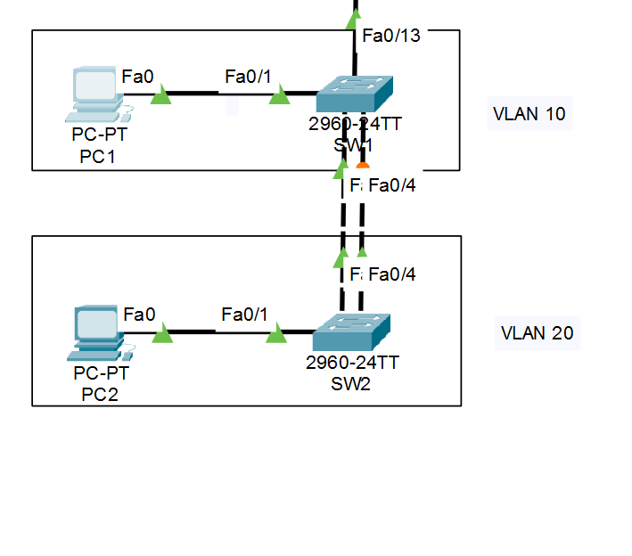
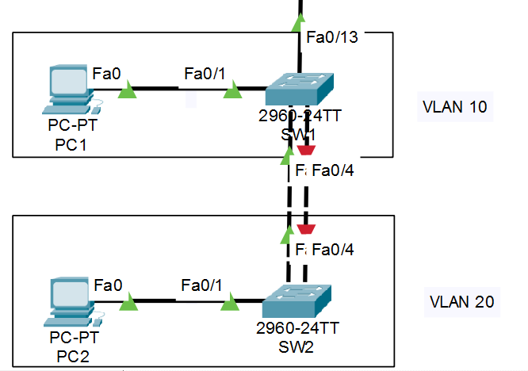
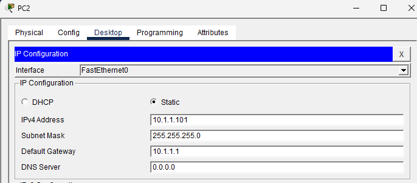
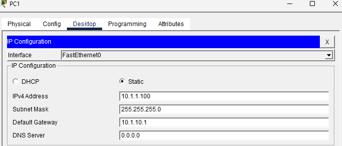

# Cisco — Les VLAN, le concept et le Trunking

*Théorie + Lab 4-1 : Cédric Surquin — 05/09/23*

## Objectifs
1. Configurer les VLANs
2. Configurer le Trunking
3. Configurer un lien/des ports trunk entre les switchs

## Concepts clés

**VLAN (Virtual LAN)** : segmente un switch en plusieurs réseaux logiques indépendants — deux appareils sur des VLANs différents ne peuvent pas communiquer directement, même connectés au même switch physique.

**Trunk** : lien entre deux switchs (ou switch/routeur) qui transporte le trafic de **plusieurs VLANs simultanément** sur un seul câble physique, grâce à l'encapsulation **802.1Q** qui "tague" chaque trame avec son numéro de VLAN d'origine.

**DTP (Dynamic Trunking Protocol)** : protocole par défaut qui laisse un port décider lui-même s'il doit passer en trunk. Représente un risque de sécurité (négociation possible par un attaquant) → à désactiver avec `switchport nonegotiate` pour figer manuellement le mode.

**Router-on-a-stick** : technique permettant à un routeur de router entre plusieurs VLANs via un **seul port physique**, en créant une **sous-interface par VLAN** (chacune avec sa propre encapsulation `dot1q` et son IP), reliée au switch via un lien trunk.

## Table des commandes

| Commande | Description |
|---|---|
| `vlan N°` | Crée le VLAN (mode config globale) |
| `interface TYPE N°` | Entre en mode config d'interface |
| `switchport mode MODE` | `access` (1 seul VLAN) / `trunk` (plusieurs VLANs) / `dynamic auto`\|`desirable` (négociation) |
| `switchport access vlan N°` | Assigne un port au VLAN indiqué (mode access) |
| `switchport trunk allowed vlan N°,N°,...` | Restreint les VLANs autorisés à traverser le trunk (sinon : tous par défaut) |
| `switchport nonegotiate` | Désactive DTP, fige le mode manuellement |
| `encapsulation dot1q N°VLAN` | Active le tag 802.1Q pour un VLAN sur une sous-interface (mode trunk uniquement) |
| `ip address IP MASQUE` | Applique une IP à une interface |
| `[no] shutdown` | Active/désactive une interface |
| `show vlan` | Détail d'un VLAN (switch) |
| `show vlans` | VLANs + sous-interfaces (mode router-on-a-stick — **non simulé sur Packet Tracer**) |
| `show interface trunk` / `show interfaces trunk` | État des ports trunk |

---

# Lab 4-1 — Configuration de réseaux segmentés en VLANs

**Réalisé sur Packet Tracer**

## Topologie et adressage IP (cible du lab)

```
                    Gi0/1                    Gi0/1
                209.165.201.1/27      209.165.201.2/27
        Branch ───────────── Internet ───────────── HQ ── Server 172.16.1.100
          │ Gi0/0.1  (VLAN1)  10.1.1.1/24
          │ Gi0/0.10 (VLAN10) 10.1.10.1/24
          │ Gi0/0.20 (VLAN20) 10.1.20.1/24
          │
        Fa0/13 (trunk 1,10,20)
          │
         SW1 (10.1.1.11/24) ── Fa0/3 (trunk 1,10,20) ── Fa0/3 SW2 (10.1.1.12/24)
          │ Fa0/1 → VLAN10                                │ Fa0/1 → VLAN20
        PC1 10.1.10.100/24                              PC2 10.1.20.100/24
        gw 10.1.10.1                                     gw 10.1.20.1
```

| Appareil | Identifiants console |
|---|---|
| Branch, HQ (Cisco 2901 ISR) | `ccna` / `cisco` |
| SW1, SW2 (Catalyst 2960) | `ccna` / `cisco` |

---

## Tâche 1 — Configurer les VLANs

**Étape 1.** IP de gestion sur SW2 (VLAN1) : `10.1.1.12/24`
```
enable
configure terminal
interface vlan 1
ip address 10.1.1.12 255.255.255.0
no shutdown
end
```

**Étape 2.** IP de PC2 (temporaire, VLAN1) : `10.1.1.101/24`, gw `10.1.1.1`

**Étape 3.** Ping PC1 → PC2 (même VLAN à ce stade) → **réussi** ✓

**Étape 4.** Création des VLANs 10 et 20 sur SW1 et SW2 :
```
enable
configure terminal
vlan 10
exit
vlan 20
exit
```

**Étape 5.** Assignation des ports :
- SW1, Fa0/1 (face à PC1) → VLAN10
- SW2, Fa0/1 (face à PC2) → VLAN20
```
interface fa0/1
switchport mode access
switchport access vlan <10 ou 20>
exit
```

**Étape 6.** Sauvegarde : `copy running-config startup-config` sur SW1 et SW2

**Étape 7.** Nouvelle IP PC1 : `10.1.10.100/24`, gw `10.1.10.1`
**Étape 8.** Nouvelle IP PC2 : `10.1.20.100/24`, gw `10.1.20.1`

**Étape 9. Vérification `show vlan` — résultat obtenu :**
```
SW1#show vlan
VLAN Name       Status    Ports
---- ---------- --------- --------------------------------
1    default    active    Fa0/2-24 (sauf 0/1, 0/3, 0/13), Gig0/1, Gig0/2
10   VLAN0010   active    Fa0/1
20   VLAN0020   active

SW2#show vlan
VLAN Name       Status    Ports
---- ---------- --------- --------------------------------
1    default    active    Fa0/2-24 (sauf 0/1, 0/3), Gig0/1, Gig0/2
10   VLAN0010   active
20   VLAN0020   active    Fa0/1
```
→ Confirmé : SW1/Fa0/1 dans VLAN10, SW2/Fa0/1 dans VLAN20.

**Étape 10.** Ping PC1 → PC2 → **échoue** (`Destination host unreachable`), normal : les deux PC sont désormais sur des VLANs/réseaux séparés, sans lien entre eux à ce stade.

---

## Tâche 2 — Configurer le lien trunk entre les switchs (SW1 ↔ SW2, Fa0/3)

```
enable
configure terminal
interface fa0/3
switchport mode trunk
switchport trunk allowed vlan 1,10,20
switchport nonegotiate
end
copy running-config startup-config
```
(sur SW1 **et** SW2)

**Vérification `show interfaces trunk` :**
```
Port    Mode  Encapsulation  Status     Native vlan
Fa0/3   on    802.1q         trunking   1

Port    Vlans allowed on trunk
Fa0/3   1,10,20
```
→ Confirmé sur SW1 et SW2 (après correction : SW2 affichait d'abord `1-1005` au lieu de `1,10,20`, oubli corrigé en retapant `switchport trunk allowed vlan 1,10,20`).

**Étape 4 (attendue).** Ping PC1 → PC2 → **échoue encore** : le trunk laisse passer les VLANs, mais le routeur ne sait pas encore router entre eux.

---

## Tâche 3 — Configurer le trunk sur le routeur (router-on-a-stick)

### Étape 1 — Trunk sur SW1, port face au routeur (Fa0/13)
```
interface fa0/13
switchport mode trunk
switchport trunk allowed vlan 1,10,20
switchport nonegotiate
end
```
**⚠️ Piège rencontré :** `switchport nonegotiate` rejeté avec `Conflict between 'nonegotiate' and 'dynamic' status` car `switchport mode trunk` n'avait pas encore été appliqué avec succès (le port était resté en `dynamic auto`). Toujours vérifier avec `show interface <port> switchport` (ligne `Administrative Mode`) avant d'enchaîner les commandes suivantes.

### Étape 2 — Sauvegarde sur SW1

### Étape 3-4 — Sous-interfaces sur Branch
```
enable
configure terminal
interface g0/0
no ip address
no shutdown
exit
interface g0/0.1
encapsulation dot1q 1
ip address 10.1.1.1 255.255.255.0
exit
interface g0/0.10
encapsulation dot1q 10
ip address 10.1.10.1 255.255.255.0
exit
interface g0/0.20
encapsulation dot1q 20
ip address 10.1.20.1 255.255.255.0
exit
end
copy running-config startup-config
```

### Étape 6 — Vérification
`show vlans` (pluriel) **non simulé sur Packet Tracer** → utilisé à la place :
```
Branch>show ip interface brief
GigabitEthernet0/0      unassigned    up   up
GigabitEthernet0/0.1    10.1.1.1      up   up
GigabitEthernet0/0.10   10.1.10.1     up   up
GigabitEthernet0/0.20   10.1.20.1     up   up
```
+ `show interfaces g0/0.1 / .10 / .20` → chacune confirmée en `802.1Q Virtual LAN`, bon VLAN ID, up/up.

### Étape 7 — Test final et débogage

**Premier essai** : `ping 10.1.20.100` depuis PC1 → **échec total (100% perte)**, alors que toute la config (trunks, sous-interfaces, routage) était correcte. Diagnostic en plusieurs temps :

**1. Câble en double entre SW1 et SW2** — `show cdp neighbors` sur SW1 a révélé **deux liens physiques** entre les switchs : Fa0/3↔Fa0/3 (le trunk voulu) **et** Fa0/4↔Fa0/4 (câble en trop, resté en config par défaut). Cette boucle de niveau 2 faisait bloquer un lien par le Spanning Tree Protocol — potentiellement le bon.



**Correction :** désactivation du lien surnuméraire sur les deux switchs :
```
interface fa0/4
shutdown
end
```



**2. IP de PC2 non mise à jour** — malgré l'étape 8 du TD suivie plus tôt dans la conversation, PC2 avait conservé son ancienne IP du VLAN1 (`10.1.1.101` / gw `10.1.1.1`) au lieu de la nouvelle (`10.1.20.100` / gw `10.1.20.1`).



**3. IP de PC1 partiellement mise à jour** — cas plus sournois : la **passerelle** avait bien été changée (`10.1.10.1`, VLAN10) mais l'**adresse IP** était restée l'ancienne (`10.1.1.100`, VLAN1) → IP et passerelle sur deux réseaux différents, incohérence totale.



**Ping final (PC1 → PC2, `10.1.20.100`)** après les 3 corrections → **réussi** ✓

## Points de vigilance (erreurs à ne pas refaire)
- ⚠️ **Vérifier `Administrative Mode` avec `show interface <port> switchport` avant d'appliquer `switchport nonegotiate`** — la commande échoue si `switchport mode trunk` n'a pas été appliqué avec succès juste avant.
- ⚠️ **Toujours vérifier les 3 champs de l'IP d'un PC après un changement de VLAN** (adresse, masque, passerelle) — une mise à jour partielle (ex. passerelle changée mais pas l'adresse) est plus difficile à repérer qu'un oubli total, mais casse tout aussi bien la connectivité.
- ⚠️ **Vérifier le câblage réel avec `show cdp neighbors`** en cas de comportement réseau inexpliqué malgré une configuration logique correcte — un câble surnuméraire entre deux switchs crée une boucle L2 et peut faire bloquer par STP le lien qu'on croyait actif.
- ⚠️ Sur Packet Tracer, `show vlans` (pluriel, mode router-on-a-stick) et `show ip http server status` ne sont pas simulés — utiliser `show ip interface brief` / `show interfaces <sous-interface>` comme alternative.

## Critères de complétion (rappel du TD)
- [x] VLANs configurés (10 et 20)
- [x] Adresses IP des PC adaptées à leur VLAN
- [x] Port trunk configuré des deux côtés du lien entre les 2 switchs
- [x] Trunk configuré côté routeur avec sous-interfaces (router-on-a-stick)
- [x] Connectivité inter-VLAN vérifiée (ping PC1 ↔ PC2 réussi)
