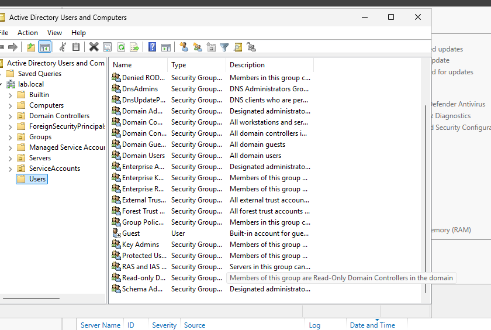
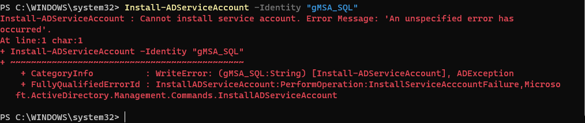
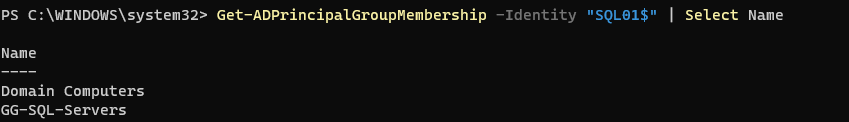
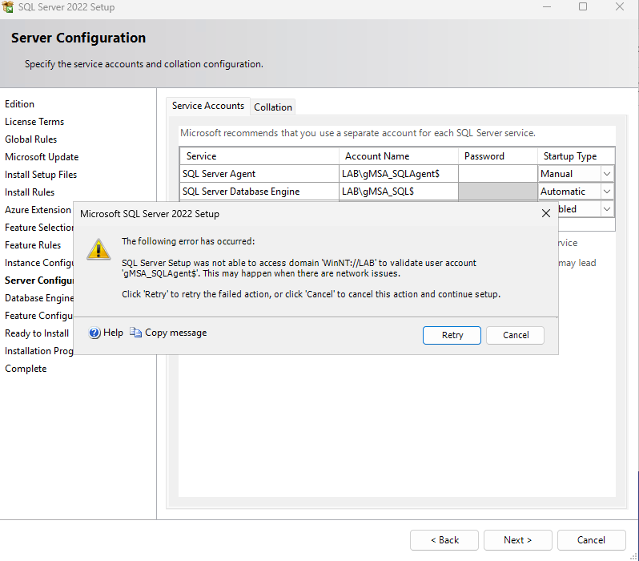
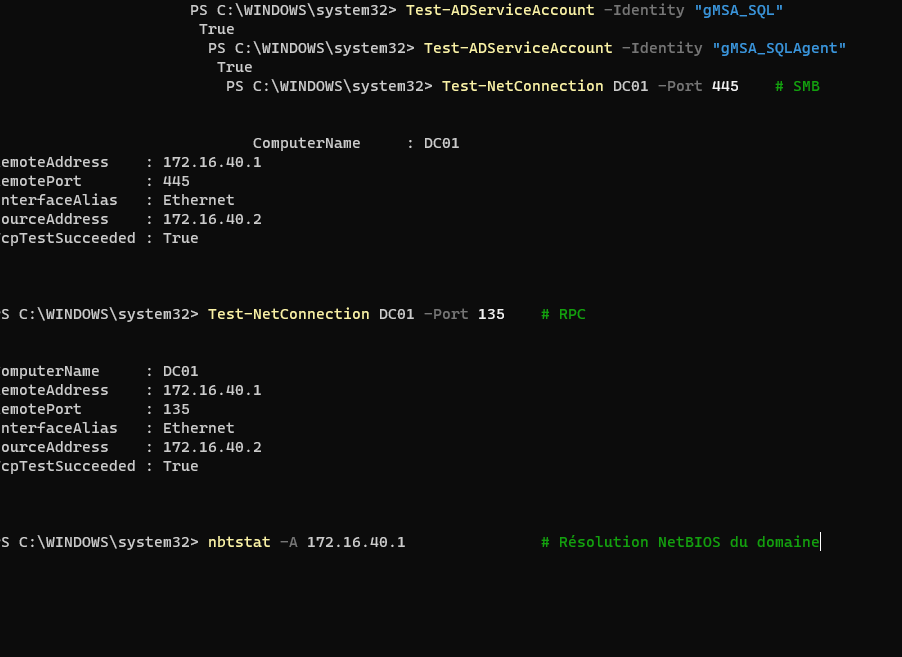
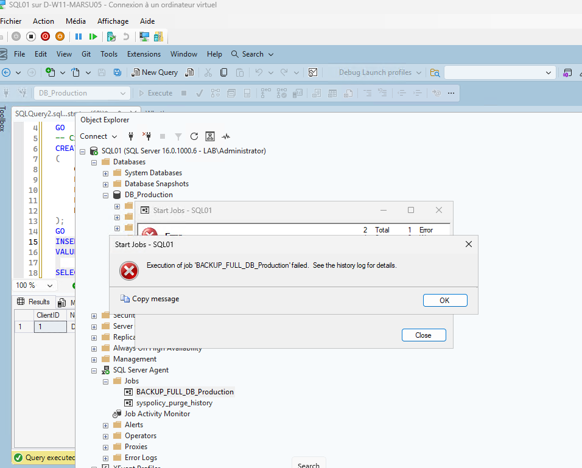
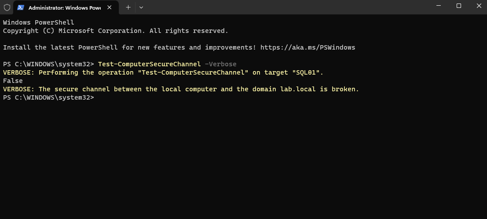
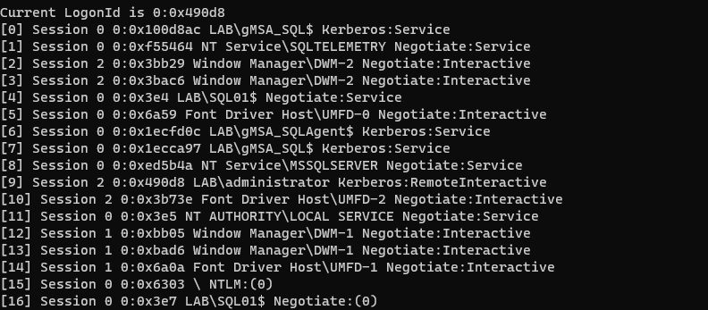
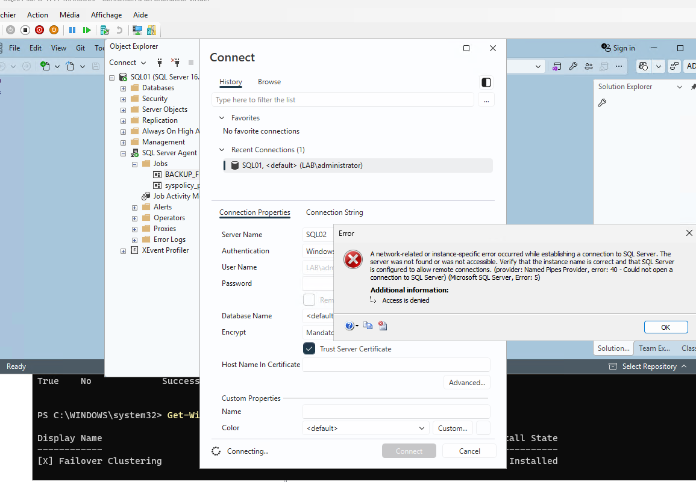

# TP Récapitulatif — Active Directory, gMSA, SQL Server & Always On

**Statut : en cours** — arrêté à la Partie 7 (activation du protocole TCP/IP sur SQL02)

---

## 1. Contexte du TP (consignes)

Mise en place d'une infrastructure Microsoft SQL Server pour une entreprise fictive. La base de données principale doit être :
- hébergée sur deux serveurs SQL ;
- sauvegardée quotidiennement ;
- hautement disponible ;
- capable de basculer automatiquement sur un second serveur en cas de panne ;
- administrée à l'aide de comptes de service sécurisés de type **gMSA**.

### Architecture attendue
```
LAB.LOCAL
├── DC01.LAB.LOCAL   (contrôleur de domaine)
├── SQL01.LAB.LOCAL  (serveur SQL, nœud 1)
└── SQL02.LAB.LOCAL  (serveur SQL, nœud 2)
```
Les deux serveurs SQL doivent disposer d'adresses IP fixes.

### Objectifs pédagogiques
Installer/configurer AD DS et DNS · joindre des serveurs au domaine · créer et utiliser des comptes gMSA · installer SQL Server · configurer les services SQL avec des comptes gMSA · créer et administrer une base SQL Server · automatiser des sauvegardes avec SQL Server Agent · installer/configurer un Windows Server Failover Cluster · configurer SQL Server Always On Availability Groups · créer un Availability Group · répliquer une base entre deux serveurs SQL · configurer un Listener · tester une bascule manuelle · simuler une panne et vérifier la haute disponibilité · restaurer une base à partir d'une sauvegarde.

## 2. Environnement

| Machine | Rôle | IP | Masque | Passerelle | DNS |
|---|---|---|---|---|---|
| DC01 | Contrôleur de domaine | 172.16.40.1 | /24 | 172.16.40.254 | 172.16.40.1 |
| SQL01 | Serveur SQL (nœud 1) | 172.16.40.2 | /24 | 172.16.40.254 | 172.16.40.1 |
| SQL02 | Serveur SQL (nœud 2) | 172.16.40.3 | /24 | 172.16.40.254 | 172.16.40.1 |

**Domaine :** `lab.local`

---

## 3. Suivi des parties du TP

| Partie | Contenu | Statut |
|---|---|---|
| 1 | Installation Active Directory | ✅ Fait (avant le début de ce journal) |
| 1 (suite) | Structure d'OU + groupe GG-SQL-Servers | ✅ Fait |
| 2 | Configuration des gMSA | ✅ Fait |
| 3 | Installation des serveurs SQL | ✅ Fait sur SQL01 — ⏳ en cours sur SQL02 |
| 4 | Création de la base DB_Production | ✅ Fait |
| 5 | Sauvegarde automatique (Job Agent) | ✅ Fait |
| 7 | Installation du Failover Cluster | ⏳ **En cours — bloqué sur SQL02** |
| 8 | Quorum | ⬜ À faire |
| 9 | Activation Always On | ⬜ À faire |
| 10 | Préparation de la base avant AG | ⬜ À faire |
| 11 | Création de l'Availability Group | ⬜ À faire |
| 12 | Création du Listener | ⬜ À faire |
| 13 | Tests de haute disponibilité | ⬜ À faire |

---

## 4. Partie 1 (suite) — Structure AD : OU et groupe

### Question posée
> Est-ce mieux de créer une Organizational Unit plutôt qu'un groupe pour `GG-SQL-Servers` ?

**Réponse retenue :** ce n'est pas l'un ou l'autre — les deux sont complémentaires. L'**OU** organise l'annuaire (GPO, délégation), le **groupe** sert à donner des permissions collectives (notamment pour autoriser SQL01/SQL02 à récupérer le mot de passe des gMSA en Partie 2).

### Commandes exécutées
```powershell
# Structure d'OU
New-ADOrganizationalUnit -Name "Servers" -Path "DC=lab,DC=local"
New-ADOrganizationalUnit -Name "SQL" -Path "OU=Servers,DC=lab,DC=local"
New-ADOrganizationalUnit -Name "Infrastructure" -Path "OU=Servers,DC=lab,DC=local"
New-ADOrganizationalUnit -Name "Groups" -Path "DC=lab,DC=local"
New-ADOrganizationalUnit -Name "ServiceAccounts" -Path "DC=lab,DC=local"

# Groupe de sécurité (GG = Global Group)
New-ADGroup -Name "GG-SQL-Servers" -GroupScope Global -GroupCategory Security -Path "OU=Groups,DC=lab,DC=local"
Add-ADGroupMember -Identity "GG-SQL-Servers" -Members "SQL01$","SQL02$"
```

### ⚠️ Erreur rencontrée — OU/groupe invisibles dans la console graphique
**Symptôme :** après exécution des commandes PowerShell, les OU/le groupe ne semblaient pas apparaître dans *Active Directory Users and Computers*.
**Cause réelle :** fausse alerte — les objets étaient bien créés, il fallait simplement déplier les sous-conteneurs (`Servers` → `SQL`/`Infrastructure`, `Groups` → `GG-SQL-Servers`) dans l'arborescence.
**Résolution :** vérification via commande, confirmée correcte :
```powershell
Get-ADOrganizationalUnit -Filter * | Select-Object Name, DistinguishedName
Get-ADGroup -Filter {Name -eq "GG-SQL-Servers"}
```


*Structure d'OU (Servers, Groups, ServiceAccounts) et groupe `GG-SQL-Servers` bien présents une fois dépliés.*

---

## 5. Partie 2 — Comptes gMSA

### Commandes exécutées
```powershell
# Sur DC01 — clé racine KDS (décalage horaire pour usage immédiat en labo)
Add-KdsRootKey -EffectiveTime (Get-Date).AddHours(-10)

# Création des deux comptes gMSA
New-ADServiceAccount -Name "gMSA_SQL" -DNSHostName "gMSA_SQL.lab.local" `
    -PrincipalsAllowedToRetrieveManagedPassword "GG-SQL-Servers"
New-ADServiceAccount -Name "gMSA_SQLAgent" -DNSHostName "gMSA_SQLAgent.lab.local" `
    -PrincipalsAllowedToRetrieveManagedPassword "GG-SQL-Servers"

# Sur SQL01 (et SQL02) — installation locale
Install-WindowsFeature RSAT-AD-PowerShell
Install-ADServiceAccount -Identity "gMSA_SQL"
Install-ADServiceAccount -Identity "gMSA_SQLAgent"
```

### ⚠️ Erreur rencontrée — `Install-ADServiceAccount` échoue
**Message :**
```
Install-ADServiceAccount : Cannot install service account. Error Message: 'An unspecified error has occurred'.
```


**Diagnostic mené (hypothèses écartées une à une) :**
1. KDS Root Key pas encore effective → vérifiée avec `Get-KdsRootKey`, `EffectiveTime` déjà passée → **écarté**
2. Appartenance au groupe non répliquée → vérifiée avec `Get-ADPrincipalGroupMembership -Identity "SQL01$"` → `GG-SQL-Servers` bien présent → **écarté** (mais ticket Kerberos pas encore rafraîchi)



**Cause réelle :** ticket Kerberos de la machine `SQL01$` pas encore actualisé pour refléter sa nouvelle appartenance au groupe `GG-SQL-Servers`.

**Solution appliquée :**
```powershell
klist purge
gpupdate /force
# puis redémarrage complet de la VM (klist purge seul insuffisant pour un compte machine)
```
Après redémarrage : `Test-ADServiceAccount` est passé à `True` pour les deux comptes.

### Points à retenir (théorie demandée par le TP)
- **Pourquoi un gMSA plutôt qu'un compte utilisateur classique ?** Mot de passe généré automatiquement (120 caractères), renouvelé tous les 30 jours par AD, jamais connu d'un humain.
- **Qui gère le mot de passe ?** Le contrôleur de domaine, via la KDS Root Key.
- **Pourquoi le `$` dans le nom ?** Convention désignant un compte de type machine/service (non interactif).

---

## 6. Partie 3 — Installation des serveurs SQL

### SQL01 — Feature Selection
Seul **Database Engine Services** coché (rien d'autre requis pour ce TP).

### ⚠️ Erreur rencontrée — Comptes gMSA refusés à l'écran Server Configuration
**Message :**
```
SQL Server Setup was not able to access domain 'WinNT://LAB' to validate user account 'gMSA_SQLAgent$'.
This may happen when there are network issues.
```


**Hypothèse envisagée par l'utilisatrice :** un problème dans la configuration Active Directory (comptes/groupe mal configurés).

**Diagnostic mené pour vérifier cette hypothèse :**
```powershell
Test-NetConnection DC01 -Port 389    # LDAP → True
Test-NetConnection DC01 -Port 445    # SMB → True
Test-NetConnection DC01 -Port 135    # RPC → True
Test-ADServiceAccount -Identity "gMSA_SQL"       # → True
Test-ADServiceAccount -Identity "gMSA_SQLAgent"  # → True
Get-ADServiceAccount -Identity "gMSA_SQLAgent" -Properties * |
    Select Enabled, PasswordNeverExpires, PrincipalsAllowedToRetrieveManagedPassword, ServicePrincipalNames
# → Enabled: True, PrincipalsAllowedToRetrieveManagedPassword: GG-SQL-Servers (correct)
```


**Conclusion du diagnostic :** l'hypothèse AD a été **écartée** — tout est sain côté annuaire, réseau LDAP/SMB/RPC, et comptes de service. La cause est un **bug connu du fournisseur WinNT** utilisé par l'installeur SQL Server 2022 pour valider les comptes gMSA (mécanisme NetBIOS/RPC différent de LDAP, qui gère mal les comptes se terminant par `$`), indépendant de la configuration de l'infrastructure.

**Solution retenue (contournement fiable) :**
1. Installer SQL Server avec les comptes **par défaut** proposés par l'installeur (`NT Service\SQLSERVERAGENT`, `NT Service\MSSQLSERVER`)
2. Une fois l'installation terminée, basculer vers les comptes gMSA via **SQL Server Configuration Manager** (qui valide différemment et n'a pas ce bug) :
```
SQL Server Configuration Manager → SQL Server Services
→ clic droit "SQL Server (MSSQLSERVER)" → Properties → onglet "Log On"
→ "This account" → LAB\gMSA_SQL$ → mot de passe vide → OK → redémarrer le service
→ clic droit "SQL Server Agent" → Properties → onglet "Log On"
→ "This account" → LAB\gMSA_SQLAgent$ → mot de passe vide → OK → redémarrer le service
```
✅ Fonctionne sans erreur. Vérification finale :
```powershell
Get-CimInstance Win32_Service -Filter "Name='MSSQLSERVER' OR Name='SQLSERVERAGENT'" |
    Select-Object Name, StartName, State
# MSSQLSERVER    → LAB\gMSA_SQL$      → Running
# SQLSERVERAGENT → LAB\gMSA_SQLAgent$ → Running
```

### Database Engine Configuration — chemins retenus
⚠️ Les lettres de disque réelles de la VM diffèrent de l'exemple initial du guide (D:/E:) :

| Champ | Valeur |
|---|---|
| Data root / User database directory | `D:\MSSQL\Data` |
| User database log directory | `L:\MSSQL\Log` |
| Backup directory | `D:\MSSQL\BACKUP` |

*(Disques réels sur la VM : `C:` système, `D:` Data, `L:` Log, `T:` TempDB)*

**Note :** l'installeur crée automatiquement les dossiers manquants à cette étape si besoin — pas obligatoire de les précréer avant, contrairement à ce qui avait été supposé initialement.

**Option "Grant Perform Volume Maintenance Tasks" :** laissée décochée (non demandée par le TP, gain de perf non pertinent pour un labo).

### SQL02
⏳ **En cours** — installation similaire lancée, arrêtée à l'étape d'activation du protocole **TCP/IP** dans SQL Server Configuration Manager (nécessaire pour permettre la connexion distante depuis SSMS/SQL01).

---

## 7. Partie 4 — Base de données DB_Production

Exécuté avec succès sur SQL01 :
```sql
CREATE DATABASE DB_Production;
GO
USE DB_Production;
GO

CREATE TABLE Clients
(
    ClientID INT IDENTITY(1,1) PRIMARY KEY,
    Nom NVARCHAR(100),
    Prenom NVARCHAR(100),
    Email NVARCHAR(255),
    DateCreation DATETIME DEFAULT GETDATE()
);
GO

-- Test d'insertion
INSERT INTO Clients (Nom, Prenom, Email)
VALUES ('Dupont', 'Jean', 'jean.dupont@lab.local');

SELECT * FROM Clients;
-- Résultat : ClientID=1, Dupont, Jean, jean.dupont@lab.local, DateCreation auto-remplie
```
✅ Aucune erreur — base et table créées, insertion test réussie.

---

## 8. Partie 5 — Sauvegarde automatique

### 8.1 Recovery Model
```sql
ALTER DATABASE DB_Production SET RECOVERY FULL;
GO
```

### 8.2 Job SQL Server Agent
**Nom du Job :** `BACKUP_FULL_DB_Production`
**Step "Full Backup" (T-SQL) :**
```sql
BACKUP DATABASE DB_Production
TO DISK = N'D:\MSSQL\BACKUP\DB_Production_Full.bak'
WITH FORMAT, NAME = N'DB_Production-Full Database Backup', STATS = 10;
```
**Schedule :** Daily.

### ⚠️ Erreur n°1 — Le Job échoue à l'exécution (owner)
**Message :**
```
Unable to determine if the owner (LAB\Administrator) of job BACKUP_FULL_DB_Production has server access
(reason: Could not obtain information about Windows NT group/user 'LAB\Administrator', error code 0x54b.
[SQLSTATE 42000] (Error 15404))
```


**Cause identifiée par l'utilisatrice :** la VM SQL01 était passée en **DHCP** temporairement (pour télécharger SSMS) et n'avait pas récupéré son IP fixe `172.16.40.2`, cassant la communication avec DC01.

**Diagnostic :**
```powershell
Test-ComputerSecureChannel -Verbose
# → False : "The secure channel between the local computer and the domain lab.local is broken."
```


**Résolution en plusieurs temps :**
1. Remise de l'IP fixe :
```powershell
New-NetIPAddress -InterfaceAlias "Ethernet" -IPAddress 172.16.40.2 -PrefixLength 24 -DefaultGateway 172.16.40.254
Set-DnsClientServerAddress -InterfaceAlias "Ethernet" -ServerAddresses 172.16.40.1
```
2. Purge ciblée du ticket Kerberos du compte de service concerné (`LAB\gMSA_SQLAgent$`), identifié via :
```powershell
klist sessions
# [6] Session 0 0:0x1ecfd0c LAB\gMSA_SQLAgent$ Kerberos:Service
```

```powershell
klist purge -li 0x1ecfd0c
Restart-Service SQLSERVERAGENT -Force
```
3. Nouveau test : `Test-ComputerSecureChannel -Verbose` → **True**

💡 **Commande annexe découverte pendant le dépannage** (rafraîchit spécifiquement le cache Kerberos de la session SYSTEM, LUID fixe `0x3e7`) :
```powershell
klist purge -li 0x3e7
```

### ⚠️ Erreur n°2 — Le Job échoue toujours (chemin de sauvegarde)
Une fois le canal sécurisé réparé, le Job passait l'étape d'authentification mais échouait encore sur l'étape d'exécution :
```
Executed as user: LAB\gMSA_SQLAgent$. Cannot open backup device 'D:\SQLBackup\DB_Production_Full.bak'.
Operating system error 3(The system cannot find the path specified.). [SQLSTATE 42000] (Error 3201)
BACKUP DATABASE is terminating abnormally. [SQLSTATE 42000] (Error 3013). The step failed.
```
**Cause :** le dossier `D:\SQLBackup` (chemin initialement suggéré) n'existait pas — le dossier réellement présent sur la VM est `D:\MSSQL\BACKUP`.

**Résolution :** commande du Step corrigée pour pointer vers le dossier existant :
```sql
BACKUP DATABASE DB_Production
TO DISK = N'D:\MSSQL\BACKUP\DB_Production_Full.bak'
WITH FORMAT, NAME = N'DB_Production-Full Database Backup', STATS = 10;
```
✅ Job relancé avec succès — fichier `.bak` créé, statut **Succeeded**.

---

## 9. Partie 7 — Failover Cluster ⏳ EN COURS

### Étapes prévues
```powershell
# Sur SQL01 ET SQL02
Install-WindowsFeature -Name Failover-Clustering -IncludeManagementTools
Get-WindowsFeature Failover-Clustering   # doit afficher "Installed"

# Depuis SQL01
Test-Cluster -Node SQL01,SQL02

# Création du cluster
New-Cluster -Name "SQL-CLUSTER" -Node SQL01,SQL02 -StaticAddress 172.16.40.10
```

### État actuel
- `Failover-Clustering` installé sur **SQL01** ✅
- Installation en cours sur **SQL02**

### ⚠️ Blocage actuel — Connexion SSMS vers SQL02 refusée
**Message :**
```
A network-related or instance-specific error occurred while establishing a connection to SQL Server.
The server was not found or was not accessible. Verify that the instance name is correct and that SQL
Server is configured to allow remote connections. (provider: Named Pipes Provider, error: 40 - Could not
open a connection to SQL Server) (Microsoft SQL Server, Error: 5)
Additional information: Access is denied
```


**Diagnostic en cours :** cette erreur (différente des erreurs de certificat SSL déjà rencontrées) pointe vers un protocole réseau non activé ou un blocage pare-feu sur SQL02, plutôt qu'un souci d'authentification.

**Pistes identifiées, à vérifier à la reprise :**
1. **Activer le protocole TCP/IP sur SQL02** (point d'arrêt de la session) :
   - SQL Server Configuration Manager → SQL Server Network Configuration → Protocols for MSSQLSERVER → TCP/IP → Enabled
   - Redémarrer le service SQL Server après activation
2. Vérifier/ajouter une règle de pare-feu entrante sur SQL02 :
```powershell
New-NetFirewallRule -DisplayName "SQL Server" -Direction Inbound -Protocol TCP -LocalPort 1433 -Action Allow
```

---

## 10. Prochaines étapes (reprise du TP)

1. Activer TCP/IP sur SQL02 + règle pare-feu, revalider la connexion SSMS
2. Terminer l'installation de `Failover-Clustering` sur SQL02
3. `Test-Cluster` puis `New-Cluster`
4. Partie 8 — Quorum
5. Partie 9 — Activation Always On (SQL01 + SQL02)
6. Partie 10 — Préparation de la base (Full Backup + Log Backup avant AG)
7. Partie 11 — Création de l'Availability Group `AG-PRODUCTION`
8. Partie 12 — Listener `SQL-PROD`
9. Partie 13 — Tests de bascule (identification Primary, failover manuel SQL01 → SQL02)

---

## 11. Récapitulatif — Journal des erreurs et résolutions

| # | Contexte | Erreur | Cause réelle | Solution |
|---|---|---|---|---|
| 1 | Partie 2 — gMSA | `Install-ADServiceAccount` : unspecified error | Ticket Kerberos machine pas rafraîchi après ajout au groupe | `klist purge` + `gpupdate /force` + redémarrage VM |
| 2 | Partie 3 — Install SQL | Setup incapable de valider `LAB\gMSA_SQLAgent$` (WinNT provider) | Bug connu de l'installeur SQL Server avec les comptes gMSA (fournisseur WinNT) | Installer avec comptes par défaut, puis basculer vers gMSA via SQL Server Configuration Manager |
| 3 | Partie 5 — Job Agent | Erreur 15404 : owner `LAB\Administrator` non résolu | Canal sécurisé cassé (VM passée en DHCP puis remise en IP fixe sans réparation du secure channel) | IP fixe restaurée + `klist purge -li <LUID gMSA_SQLAgent$>` + `Restart-Service SQLSERVERAGENT -Force` |
| 4 | Partie 5 — Job Agent | Erreur 3201/3013 : chemin de sauvegarde introuvable | Dossier `D:\SQLBackup` inexistant (dossier réel : `D:\MSSQL\BACKUP`) | Commande BACKUP corrigée avec le bon chemin |
| 5 | Partie 7 — Cluster | SSMS → SQL02 : Named Pipes error 40 / Access denied | Protocole TCP/IP probablement désactivé sur SQL02 | ⏳ En cours de résolution (activation TCP/IP + règle pare-feu) |
